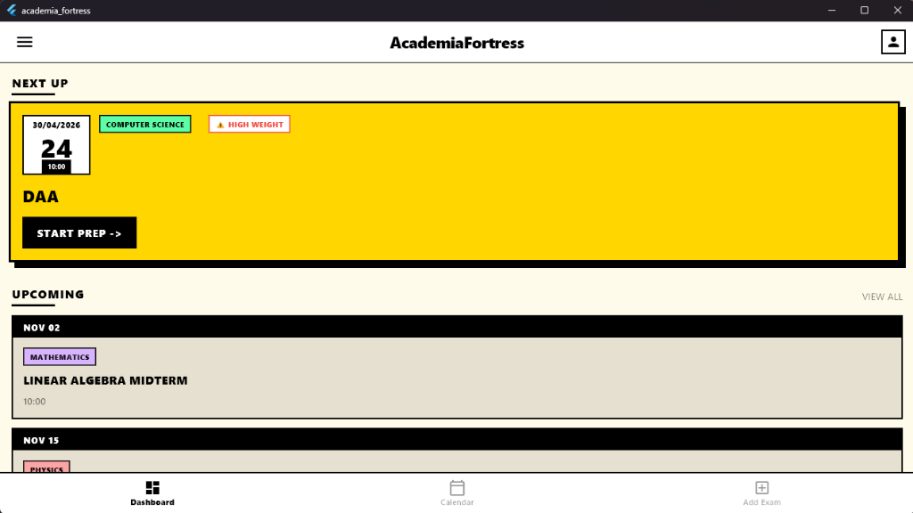
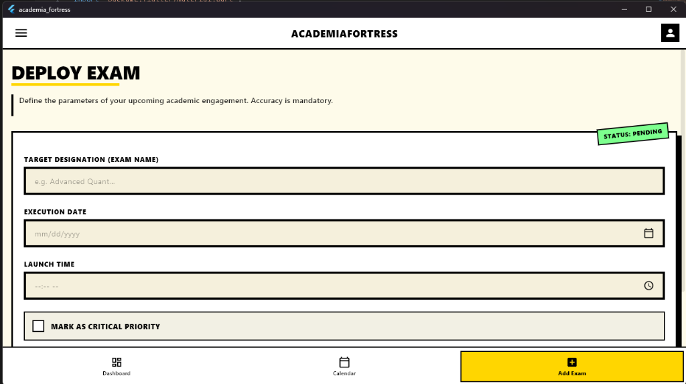

# AcademiaFortress

A brutalist-styled Flutter exam tracker app powered by Supabase. Track upcoming exams, mark high-priority subjects, and stay ahead of your academic schedule.

---

## 📸 Screenshots

| Dashboard | Add Exam |
|-----------|----------|
|  |  |

---

## ✨ Features

- **Next Up** panel — highlights your most imminent exam with urgency tags
- **Upcoming exams** list with subject, date, and time
- **Deploy Exam** screen — add exams with name, date, time, and critical priority flag
- **Academic Calendar** — visual overview of scheduled exams
- Real-time sync via **Supabase**

---

## 🚀 Setup & Running Locally

### Prerequisites

- [Flutter SDK](https://docs.flutter.dev/get-started/install) ≥ 3.0
- [Dart SDK](https://dart.dev/get-dart) ≥ 3.0
- A [Supabase](https://supabase.com) project

---

### 1. Clone the repository

```bash
git clone https://github.com/rishit-exe/AcademiaFortress.git
cd AcademiaFortress
```

### 2. Set up Supabase

Create a project at [supabase.com](https://supabase.com), then run the SQL in `table.sql` inside your Supabase SQL editor to create the required tables.

### 3. Configure environment variables

Copy the example env file and fill in your Supabase credentials:

```bash
cp env.example .env
```

Edit `.env`:

```env
SUPABASE_URL=https://your-project-id.supabase.co
SUPABASE_ANON_KEY=your-anon-key-here
```

> You can find these values in your Supabase project under **Settings → API**.

### 4. Install dependencies

```bash
flutter pub get
```

### 5. Run the app

```bash
# Desktop (Windows)
flutter run -d windows

# Web
flutter run -d chrome

# Android / iOS (with a device or emulator connected)
flutter run
```

---

## 🗄️ Database Schema

The database schema is in [`table.sql`](table.sql). Run it in your Supabase SQL editor before launching the app.

---

## 📦 Dependencies

| Package | Purpose |
|---|---|
| `supabase_flutter` | Backend & real-time database |
| `flutter_dotenv` | Environment variable management |
| `cupertino_icons` | iOS-style icon support |

---

## 📄 License

[MIT](LICENSE)
